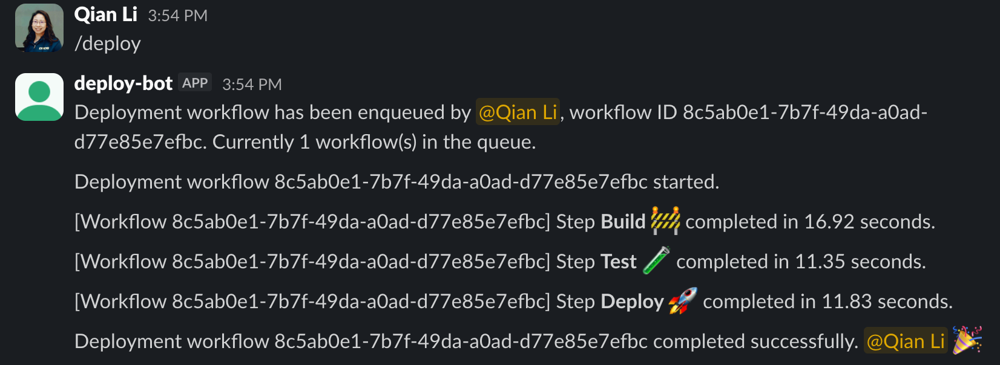
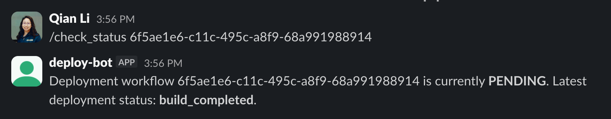

# Deploy Tracker Slackbot

This is an example Slackbot that demonstrates how to build **reliable webhooks and long-running background workflows** with DBOS.

The bot helps you trigger deployments and track deployment pipeline progress directly from Slack. It listens to commands such as `/deploy` and `/check_status` in a Slack channel and posts status updates back to the channel.

This app demonstrates how DBOS enables:

* **Asynchronous background workflows** for each deployment.
* **Concurrency control using queues**: configured with a concurrency limit of 1, so only one deployment runs at a time
* **Real-time status updates** via DBOS events
* **Durable execution**: making sure a deployment resumes from where it left off even if the Slackbot crashes or restarts


## Set Up Slack

You'll need a Slack workspace where you have permission to install apps (admin access required).

### Create a Slack App

1. Go to [Your Apps](https://api.slack.com/apps) and click **Create New App**.
2. Grant the bot the `chat:write` scope so it can send messages to Slack channels.

Once the app is created, retrieve the **Signing Secret**, which allows your app to verify that incoming requests are from Slack. You can find it under:
`Settings > Basic Information > Signing Secret`

Set it as an environment variable:

```shell
export SLACK_SIGNING_SECRET=<your_secret>
```


### Install the App to Your Workspace

1. Click **Settings > Install App** in the sidebar to install the app into your workspace.
2. After installation, you’ll receive a **Bot User OAuth Token**. The token should start with `xoxb`.

Set it as an environment variable:

```shell
export SLACK_BOT_TOKEN=<your_token>
```

Next, add the bot to a Slack channel:

* Click the channel name in the channel header
* Open the **Integrations** tab
* Search for your bot and add it to the channel


### Create Slash Commands

Navigate to **Features > Slash Commands** and define the following commands:

* `/deploy`
  Starts a deployment workflow asynchronously in the background.

* `/check_status [workflow_id]`
  Checks the status and progress of a deployment workflow.

For each command, set the **Request URL** to a publicly accessible endpoint (we'll show how to set up one with ngrok in the next section):

```
https://<PUBLIC_URL>/slack/events
```

## Run the App

1. Install dependencies

```shell
uv sync
```


2. (Optional) Connect to Postgres

DBOS supports both SQLite and Postgres:

* SQLite is used by default for development
* To use Postgres, set the `DBOS_SYSTEM_DATABASE_URL` environment variable to your Postgres connection string

```shell
export DBOS_SYSTEM_DATABASE_URL=...
```


3. (Optional) Connect to DBOS Conductor

To enable production-grade orchestration and observability, you can connect to [DBOS Conductor](https://docs.dbos.dev/production/self-hosting/conductor):

```shell
export DBOS_CONDUCTOR_KEY=...
```

4. Start the app

```shell
uv run python main.py
```

The app listens for incoming Slack events on port **3000**.

In a separate terminal, use [ngrok](https://ngrok.com/) to expose your local server to Slack:

```shell
ngrok http 3000
```

Use the generated public URL as the **Request URL** in your Slack app configuration.


## Using the Bot

Once everything is set up, you can start interacting with the bot from Slack.

### Start a deployment

Use this slash command to start a deployment workflow:
```text
/deploy
```

The bot returns a workflow ID immediately without waiting for the workflow to finish, and posts real-time updates to the channel as the deployment progresses.

If multiple deployments are triggered, **only one will run at a time**, enforced by the DBOS queue concurrency limit.




### Check deployment status

Use this slash command to check the status of a specific workflow:
```text
/check_status <workflow-id>
```

This command displays:

* The current DBOS workflow status
* Any custom status updates emitted by the deployment workflow


