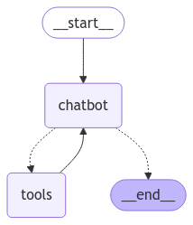

# Reliable Customer Service Agent Powered by DBOS and LangGraph

This is an AI agent built with DBOS and LangGraph, demonstrating human-in-the-loop pattern with LLM interactions.

You can chat with this LLM-powered AI agent to:
-  Check the status of your purchase order.
- Request a refund for your order.

The agent is a stateful graph constructed with LangGraph. The architecture diagram is shown below:



The `tools` include two DBOS decorated functions: a database transaction function to retrieve order status, and a refund workflow to process refund requests.

## Asynchronous Human-in-the-Loop Processing

What makes this agent unique is its ability to leverage DBOS for asynchronous human-in-the-loop processing. This is typically challenging to write, but DBOS makes it simple and reliable.

If an order exceeds a certain cost threshold, the refund request will be escalated for manual review. In this case, the refund workflow contains the following step:
- An email is sent to an admin for approval.
- The refund workflow **pauses** until a human decision is made.
- Based on the response, the workflow either proceeds with the refund or rejects the request.
as an email to the admin for a manual review.

The tool invokes the refund workflow to execute asynchronously and returns back to the chatbot as soon as the workflow is started, so the chatbot is not blocked by the potentially long review period.

This demonstrates how **DBOS simplifies complex workflows**, making it easier to integrate human decision-making into automated processes.

## Creating an OpenAI Account

To run this app, you need an OpenAI developer account.
Obtain an API key [here](https://platform.openai.com/api-keys) and set up a payment method for your account [here](https://platform.openai.com/account/billing/overview).
This bot uses `gpt-3.5-turbo` for text generation.
Make sure you have some credits (~$1) to use it.

Set your API key as an environment variable:

```shell
export OPENAI_API_KEY=<your_openai_key>
```

## Setting Up SendGrid

This app uses [SendGrid](https://sendgrid.com/en-us) to send emails.
Create a SendGrid account, verify an email for sending, and generate an API key.
Then set the API key and sender email as environment variables:

```shell
export SENDGRID_API_KEY=<your key>
export SENDGRID_FROM_EMAIL=<your email>
export ADMIN_EMAIL=<your email>
```

### Deploying to the Cloud

To serverlessly deploy this app to DBOS Cloud, first install the DBOS Cloud CLI (requires Node):

```shell
npm i -g @dbos-inc/dbos-cloud
```

Then, run this command to deploy your app:

```shell
dbos-cloud app deploy
```

This command outputs a URL&mdash;visit it to see your chatbot!
You can also visit the [DBOS Cloud Console](https://console.dbos.dev/login-redirect) to see your app's status and logs.

### Running Locally

First create a virtual environment and install dependencies:

```shell
python3 -m venv .venv
source .venv/bin/activate
pip install -r requirements.txt
```


Then start your app in the virtual environment:

```shell
alembic upgrade head
dbos start
```

Visit [`http://localhost:8000`](http://localhost:8000) to see your customer service chatbot!