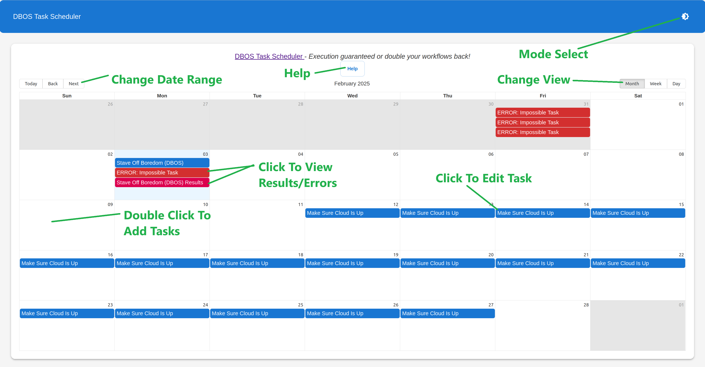
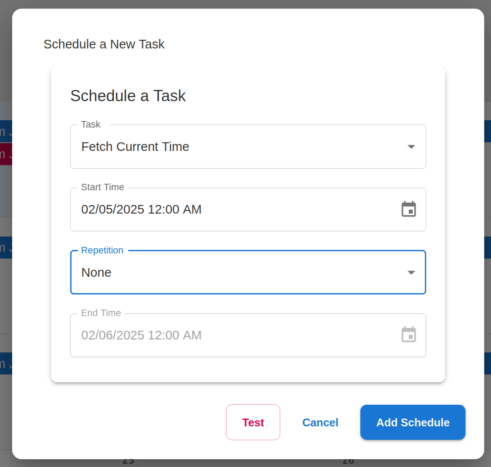
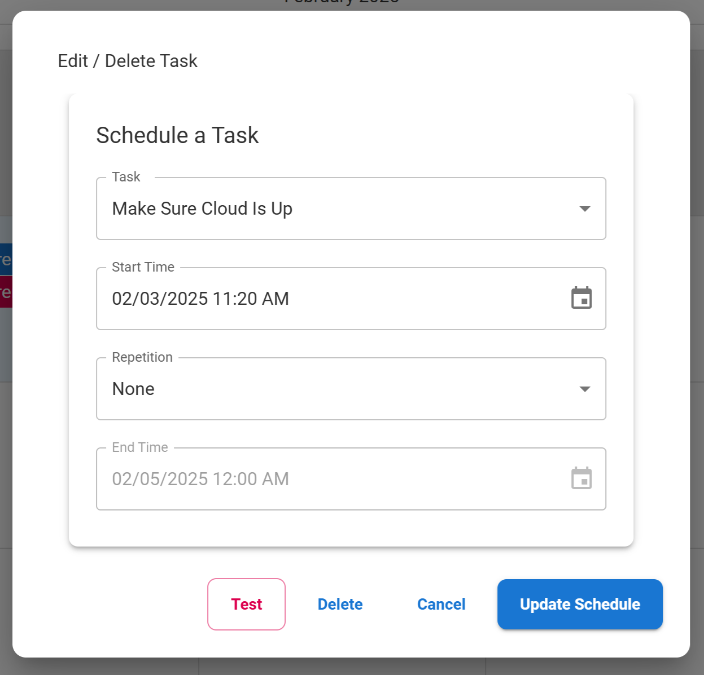
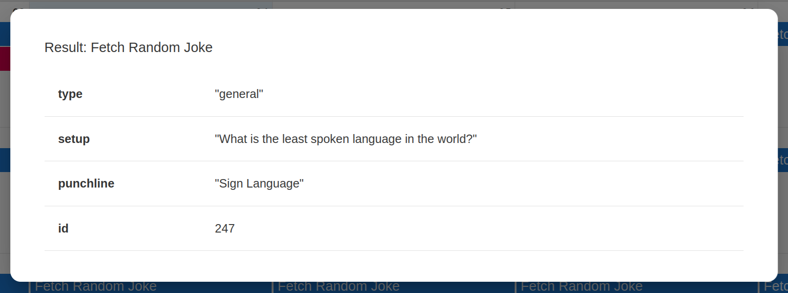

# Welcome to DBOS Task Scheduler!
DBOS Task Scheduler is a full-stack app built with [Next.js](https://nextjs.org/) and [DBOS](https://dbos.dev).  It serves as both a demo for learning DBOS concepts and a template for building your own DBOS-powered Next.js applications.

If you like the idea of a cloud-based task scheduler with a calendar UI, you can easily [customize it with your own tasks](#task-code) and deploy it to DBOS Cloud [DBOS Cloud](https://www.dbos.dev/dbos-cloud) for free.

## Why Use Next.js With DBOS?
Combining DBOS Transact with Next.js offers a powerful backend and frontend pairing that is easily deployed to DBOS Cloud.

While DBOS Transact provides durable backend execution, it does not include a user interface.  Next.js is an excellent complement, offering a [React](https://react.dev/)-based UI, [server-side rendering (SSR)](https://nextjs.org/docs/pages/building-your-application/rendering/server-side-rendering) for performance, and [server actions](https://nextjs.org/docs/app/building-your-application/data-fetching/server-actions-and-mutations) for convenient data fetching and interaction.

Existing Next.js hosting options focus on serverless, CDN-heavy applications.  Running Next.js with DBOS Transact on DBOS Cloud unlocks additional benefits:
- Lightweight durable execution – DBOS [workflows](https://docs.dbos.dev/typescript/tutorials/workflow-tutorial) run to completion exactly once.
- Background tasks and WebSockets – Keep execution and state across UI calls, with the ability to send results back to the client.
- External systems integration – [Place calls to external services](https://docs.dbos.dev/typescript/tutorials/step-tutorial) with much simpler error recovery.
- Simple, powerful database integration – [Manage database data](https://docs.dbos.dev/typescript/tutorials/transaction-tutorial) with DBOS.
- Cron-style task scheduling – Automate recurring jobs with [built-in scheduling](https://docs.dbos.dev/typescript/tutorials/scheduled-workflows).
- Built-in tracing and replay debugging – [Find workflows in the dashboard](https://docs.dbos.dev/cloud-tutorials/monitoring-dashboard) and [re-run them locally](https://docs.dbos.dev/cloud-tutorials/timetravel-debugging).

# Running DBOS Task Scheduler

## Running Locally
Once you have a copy of the DBOS Task Scheduler locally, run the following:

```
npm install
npm run dev
```

Note that this requires a Postgres database.  If your local environment is set up with database connection settings, these will be used.  Otherwise, the database wizard will try to start a Postgres docker image, or provision a cloud instance of Postgres for you.

When running under `npm run dev`, any changes to source files will cause the application to reload (if UI components were changed) or restart (if DBOS server components were changed).

### Production Builds

Instead of `npm run dev` it is also possible to run the following sequence of commands to run an optimized "production" build
```
npm install
npm run build
npx dbos migrate
npm run start
```

## Using The App
Once the app is running, open it in a web browser.  (By default, this will be at [http://localhost:3000/](http://localhost:3000/))

Upon opening the web browser (and perhaps dismissing the help popup), the main screen should open:



### Adding Tasks
To schedule a task, or repeating series, double click on open space on the calendar.  (The date and time clicked will be used for the initial population of the "Start Time" field.)



First, select a task from the "Task" dropdown.  All tasks involve fetching a URL and saving the contents.  To see what one does, select it, and press "Test".  The choices are:
- Fetch Current Time: Gets the GMT time from `http://worldtimeapi.org`
- Fetch Weather Data (New York): Gets weather data for New York from `https://api.open-meteo.com`
- Make Sure Cloud Is Up: Pulls data from a demo app on DBOS Cloud: `https://demo-guestbook.cloud.dbos.dev/`
- Fetch Random Joke: Gets a joke from `https://official-joke-api.appspot.com/random_joke`
- Stave Off Boredom: Attempts to get a random activity from `https://www.boredapi.com/api/activity`; this service may be down; more on this below
- Impossible Task: Tests errors by fetching `http://example.invalid`

Then, ensure that the "Start Time" is correct.  If not, change it.

If the task is to be a repeating task, select an "End Time", and set "Repetition" to "Daily", "Weekly", or "Monthly" as appropriate.

Selecting "Add Schedule" will put the task on the calendar, and save it to the application database, where the DBOS scheduler will pick it up and run it at the appropriate times.

### Editing/Removing Tasks
To edit or remove a task, click on the task's calendar item to reveal the "Edit/Delete Task" dialog.



Changes can be made to all fields except "Task".  Clicking "Test" will execute the task and add the result to the calendar.  Clicking "Update Schedule" will save any changes.  Clicking "Delete" will delete the task, along with all results for the task.

### Viewing Results
To view results and errors, click on the result calendar items.



## Setting Up Email Notifications
The DBOS Task Scheduler app will send notifications using Amazon Simple Email Service (SES).  To use this, set the following environment variables:
- AWS_REGION: The AWS region for SES service
- AWS_ACCESS_KEY_ID: The AWS access key provisioned for SES access
- AWS_SECRET_ACCESS_KEY: The access secret corresponding to AWS_ACCESS_KEY_ID
- REPORT_EMAIL_FROM_ADDRESS: The email address to use as the "from" address for results reports
- REPORT_EMAIL_TO_ADDRESS: The email address to use as the "to" address for results reports

# Code Tour

## Technologies and Concepts Demonstrated
> 💡 **Tip:** The DBOS Task Scheduler app is somewhat complex, showcasing many features.  For a simpler starting point, see [dbos-nextjs-starter](https://github.com/dbos-inc/dbos-demo-apps/tree/main/typescript/dbos-nextjs-starter).

This app uses the following:
- DBOS Workflows, Transactions, and Steps – Complete actions exactly once, record the results, and send notifications, without worrying about server disruptions
- [Knex](https://knexjs.org/) – Type-safe database access and schema management
- DBOS Scheduled Workflows – Ensure tasks are run as scheduled
- React, with [Material](https://mui.com) and [react-big-calendar](https://github.com/jquense/react-big-calendar) – Present a calendar of tasks and results
- Next.js server actions – Simple interaction between the browser-based client and the server
- Next.js API routes and DBOS HTTP endpoints – Allow access to the server logic from clients other than Next.js
- [WebSockets](https://developer.mozilla.org/en-US/docs/Web/API/WebSockets_API) – Send calendar and result updates to the browser with low latency
- Database triggers – Listen for database updates made by other VMs
- [Jest](https://jestjs.io/) – Unit test backend code


## DBOS and Database Logic

### Task Code
The list of schedulable tasks is in `src/dbos/tasks.ts`. The `schedulableTasks` array contains the available tasks, with information needed for `doTaskFetch` to execute them.  Tasks can be added by expanding the array with additional entries:
```typescript
  {
    id: 'fetch_joke', // Unique ID for the task
    name: 'Fetch Random Joke', // Text label the task
    url: 'https://official-joke-api.appspot.com/random_joke', // URL to fetch when the task runs
    type: 'json', // Type of result to expect from the task
  },
```

### Main Workflow
The main workflow for executing tasks is in `src/dbos/operations.ts`, in the `SchedulerOps` class:

```typescript
  @DBOS.workflow()
  static async runJob(sched: string, task: string, time: Date) {
    DBOS.logger.info(`Running ${task} at ${time.toString()}`);

    let resstr = "";
    let errstr = "";

    try {
      // Fetch the result
      const res = await SchedulerOps.runTask(task);
      resstr = res;

      // Store result in database
      await ScheduleDBOps.setResult(sched, task, time, res, '');
    }
    catch (e) {
      const err = e as Error;
      // Store error in database
      await ScheduleDBOps.setResult(sched, task, time, '', err.message);
      errstr = err.message;
    }

    // Tell attached clients
    SchedulerOps.notifyListeners('result');

    // Send notification
    await SchedulerOps.sendStatusEmail(
      errstr ? `Task ${task} failed` : `Task ${task} result`,
      errstr || resstr
    );
  }
```

While it may be overkill for this demo application, `runJob` will be executed durably.  That is, if the server crashes after `runTask` is complete, but the result hasn't been recorded in the database with `setResult`, or if the email hasn't been sent by `sendStatusEmail`, DBOS Transact will finish the workflow during recovery and execute those steps.

### Scheduling

Scheduling a workflow in DBOS is quite simple; simply affix the [`@DBOS.scheduled` decorator](https://docs.dbos.dev/typescript/tutorials/scheduled-workflows).  The `crontab` of `'* * * * *'` will cause `runSchedule` to execute every minute, and `runSchedule` will check the database for tasks to execute.

```typescript
  @DBOS.scheduled({crontab: '* * * * *', mode: SchedulerMode.ExactlyOncePerIntervalWhenActive })
  @DBOS.workflow()
  static async runSchedule(schedTime: Date, _atTime: Date) { /*...*/ }
```

Note that the use of `mode: SchedulerMode.ExactlyOncePerIntervalWhenActive` means that makeup work will not be performed if DBOS is down at the time that tasks are scheduled.  To make up for missed intervals, ensuring the scheduled workflows run exactly once, use `mode: SchedulerMode.ExactlyOncePerInterval`.

### Database Schema and Transactions

DBOS Task Scheduler stores its schedule and results data in a Postgres database using [Knex](https://knexjs.org/).  The code for the transactions resides in `src/dbos/dbtransactions.ts`.  For example, the `getSchedule` method in `ScheduleDBOps` retrieves the entire schedule from the database:

```typescript
  @DBOS.transaction({readOnly: true})
  static async getSchedule() {
    return await DBOS.knexClient<ScheduleRecord>('schedule').select();
  }
```

Note that the transaction function is decorated with [`@DBOS.transaction`](https://docs.dbos.dev/typescript/tutorials/transaction-tutorial).  The `ScheduleRecord` has been defined in `src/types/models.ts` and is applied to the query for type checking.

The database schema, which defines the `schedule` table, can be found in `migrations/20250122121006_create_calendar_tables/.js`:
```javascript
exports.up = function(knex) {
  return knex.schema
    .createTable('schedule', (table) => {
      table.uuid('id').primary().defaultTo(knex.raw('gen_random_uuid()'));  // Use UUID as primary key
      table.string('task').notNullable();  // Task ID
      table.datetime('start_time').notNullable();  // Scheduled time
      table.datetime('end_time').notNullable();  // Scheduled time
      table.string('repeat').notNullable();  // Repetition options
      table.timestamps(true, true);  // Adds created_at and updated_at timestamps
    })
    //...
};
```

These migrations will be run by `npx dbos migrate`, because Knex migrations are indicated in `dbos-config.yaml`:

```yaml
  migrate:
    - npx knex migrate:latest
```

### Sending Email with Amazon SES

Sending email with task results is done using Amazon SES, and the [@dbos-inc/dbos-email-ses](https://www.npmjs.com/package/@dbos-inc/dbos-email-ses) package.

All that is necessary, as shown in `src/dbos/operations.ts`, is to configure the email instance (using environment variables):
```typescript
if (!gThis.reportSes && (process.env['REPORT_EMAIL_TO_ADDRESS'] && process.env['REPORT_EMAIL_FROM_ADDRESS'])) {
  gThis.reportSes = DBOS.configureInstance(DBOS_SES, 'reportSES', {awscfgname: 'aws_config'});
}
```

And then call `send`:
```typescript
  static async sendStatusEmail(subject: string, body: string) {
    if (!gThis.reportSes) return;
    await gThis.reportSes.sendEmail({
      to: [process.env['REPORT_EMAIL_TO_ADDRESS']!],
      from: process.env['REPORT_EMAIL_FROM_ADDRESS']!,
      subject: subject,
      bodyText: body,
    });
  }
```

## UI
The user interface for DBOS Task Scheduler is built on React, with [Material](https://mui.com) and [react-big-calendar](https://github.com/jquense/react-big-calendar).

### UI Components
The app-specific UI components can be found in `src/app/components/*.tsx`, with the overall layout established in `src/app/layout.tsx` and `src/app/page.tsx`.  Nothing in these components is particularly notable; they just use core React/Next.js constructs.

### Server Actions
One of the key benefits of Next.js over straight React is [server actions](https://nextjs.org/docs/app/building-your-application/data-fetching/server-actions-and-mutations).  Server actions provide an easy way for the UI to call code on the server, without specifying the API.

Within DBOS Task Scheduler, server actions are used for updating the calendar tasks, and fetching results.  The action code can be found in `src/actions/schedule.ts`.  For example, `ScheduleForm.tsx` calls the `addSchedule` server action:

```typescript
// Add a new schedule item
export async function addSchedule(task: string, start: Date, end: Date, repeat: string) {
  const res = await ScheduleDBOps.addScheduleItem(task, start, end, repeat);
  // Tell attached clients
  SchedulerOps.notifyListeners('schedule');
  return res;
}
```

This server action will in turn call DBOS.  Note that `addSchedule` involves a remote method invocation provided by Next.js, as the `ScheduleForm` is rendered on the client, and `addSchedule` is processed on the server.

### API Routes
While server actions are convenient, they are only available to Next.js clients.  For cases where other clients should have access to the API, Next.js offers API routes.

One author of DBOS Task Scheduler wanted to fetch boredom-relieving tasks from [Bored API](https://www.boredapi.com/).  While this API was unfortunately down at the time the demo was written, this presents an opportunity to write a replacement API as part of the app.

First, the list of available activities was copied and added to `src/app/bored/db/activities.ts`.  Then the following code was set up in `src/app/api/boredactivity/route.ts` to handle the GET request for `api/boredactivity`:

```typescript
import { dbosBored } from '@/actions/bored';
import { NextResponse } from 'next/server';

export async function GET() {
  const dbb = await dbosBored();
  console.log(`Hey we called GET: ${JSON.stringify(dbb)}`);
  return NextResponse.json(dbb);
}
```

This route code then calls into the server action code:
```typescript
import { DBOSBored } from "@/dbos/operations";

export async function dbosBored() {
  return await DBOSBored.getActivity();
}
```

Which in turn calls the DBOS logic:
```typescript
export class DBOSBored {
  @DBOS.workflow()
  static async getActivity() : Promise<Activity> {
    const choice = Math.floor(await DBOSRandom.random() * activities.length);
    return activities[choice];
  }
}
```

Note that while this successfully registers the `/api/boredactivity` endpoint, it is fortunate that this API is simple... there is no API description or type checking code provided when using this method.

### DBOS Routes
DBOS provides a much simpler way to register API endpoints.

By simply decorating a method with [`@DBOS.getAPI`](https://docs.dbos.dev/typescript/tutorials/requestsandevents/http-serving-tutorial), the API will be available, with built-in type checking, and available for OpenAPI support.  The following registers the API at `/dbos/boredapi/activity`:

```typescript
  @DBOS.getApi('/dbos/boredapi/activity')
  static async boredAPIActivity() {
    return await DBOSBored.getActivity();
  }
```

### WebSockets
Another thing that is not generally possible in Next.js is real-time updates to the client.  In DBOS Task Scheduler, the client calendar should be updated when new task results arrive, or if another user alters the calendar.  While this can be achieved with polling, we can use WebSockets in DBOS.

```typescript
  static notifyListeners(type: string) {
    const gss = (globalThis as SchedulerAppGlobals).webSocketClients;
    DBOS.logger.debug(`WebSockets: Sending update '${type}' to ${gss?.size} clients`);
    gss?.forEach((client) => {
      if (client.readyState === WebSocket.OPEN) {
        client.send(JSON.stringify({type}));
      }
    });
  }
```

### Database Notifications
While WebSockets can be used to deliver notifications from DBOS to the client, a challenge arises if the database update was running on another viratual machine in the application group.  To detect this, we can watch for changes in the underlying database table, and use those updates to broadcast notifications to the WebSockets.

```typescript
  @DBTrigger({tableName: 'schedule', useDBNotifications: true, installDBTrigger: true})
  static async scheduleListener(_operation: TriggerOperation, _key: string[], _record: unknown) {
    SchedulerOps.notifyListeners('schedule');
    return Promise.resolve();
  }
```

### Next.js Custom Server
While many Next.js applications are "serverless", several of the features in DBOS Task Scheduler require a "custom server".  This file, located in `src/server.ts`, handles the following:
- Sets up all DBOS application code so that it is all available before serving requests.
- Launches DBOS, which starts any necessary workflow recovery.
- Creates an HTTP server with the WebSockets extension.
- Directs any requests starting with `/dbos` to DBOS handler logic, allowing DBOS routing to function alongside Next.js

## Configuration Files
DBOS Task Scheduler relies on a significant number of configuration files.  While an exhaustive treatment is not possible, the following sections describe some of more important bits.

### `package.json`
As is customary, `package.json` contains a list of the project's dependencies, for use by `npm` or other package managers.

`package.json` also includes the following scripts that are worth mentioning:
```json
  "scripts": {
    "dev": "npx dbos migrate && nodemon",
    "build": "next build && tsc",
    "start": "NODE_ENV=production node dist/src/server.js",
    "test": "npx dbos migrate && jest --detectOpenHandles",
    "lint": "next lint --fix"
  },
```

#### npm run dev
This script starts DBOS Task Scheduler in development mode, where code changes cause the server to automatically reload / restart.  This script automatically applies any database migrations, and uses a combination of `nodemon` and Next.js to handle code updates.

##### `nodemon.json`
While Next.js is quite good at handling updates to UI components and API routes, updates to DBOS code cannot be made incrementally.  For this reason, `nodemon` is set to watch the `dbos` directory, and restart the server if anything changes:

```json
{
  "watch": ["src/dbos/", "migrations/"],
  "ext": "ts,js,tsx,jsx",
  "ignore": ["src/**/*.test.ts"],
  "exec": "tsc && node dist/src/server.js"
}
```

#### npm run build / start
These targets build and start a "production" build of DBOS Task Scheduler.  This runs the `next` and `tsc` compilation processes, to produce client bundles, and server code.

#### npm run lint
This script checks the code for common errors, using [`eslint`](https://eslint.org/) and typical settings for a Next.js project.  There are some specific configuration overrides in `eslint.config.mjs`.

##### `eslint.config.mjs`
This file contains the `eslint` configuration.  This is based on the "next/core-web-vitals" and "next/typescript" settings, with an additional override to ignore unused variables, as long as the names are prefixed with `_`.

### `tsconfig.json`
While `tsconfig.json` is described in detail elsewhere, please note that the following uncommon settings are needed by this project:
```json
{
  "compilerOptions": {
    "experimentalDecorators": true,
    "emitDecoratorMetadata": true,
    "noEmit": false,
    "outDir": "./dist",
  },
  "exclude": [
    "node_modules", 
    "dist"
  ]
}
```

In detail:
- `experimentalDecorators`: Used by the DBOS decorator framework
- `emitDecoratorMetadata`: Used by the DBOS decorator framework
- `noEmit`, `outDir`, and `exclude`: Many Next.js projects do not emit the `.js` files corresponding to the `.ts` files, but this app needs them for custom server logic, and to load DBOS logic before requests come in.

### `next.config.ts`
To allow server actions to work in DBOS Cloud, the following was added:
```typescript
  experimental: {
    serverActions: {
      allowedOrigins: ['*.cloud.dbos.dev'], // Allow DBOS Cloud to call server actions
    },
  },
```

Changes to this file are also needed to preserve the class and function names of DBOS workflows, in case the code is being minimized.

### `dbos-config.yaml`
[`dbos-config.yaml`](https://docs.dbos.dev/typescript/reference/configuration) sets up important operational aspects, such as the database migration scripts and the environment variables for sending email.

### `knexfile.ts`
This file is used to establish a database connection for running migrations.

### `jest.config.js`
This file supports running `jest` (via `npm run test`).

### `.gitignore`
This is a list of paths, files, and filename patterns that are not to be kept in version control.

While this is mostly a template for Next.js, the following entries are specific to this project:
- .dbos
- dbos_deploy/
- node_modules/
- dist/
- *.tsbuildinfo

# Resources and Help
If you need help with this app, please join our [Discord server](https://discord.com/invite/jsmC6pXGgX).

- To learn how to create an application to DBOS Cloud, visit our [cloud quickstart](https://docs.dbos.dev/quickstart)
- For a detailed DBOS Transact tutorial, check out our [programming quickstart](https://docs.dbos.dev/typescript/programming-guide).
- To learn more about DBOS, take a look at [our documentation](https://docs.dbos.dev/) or our [source code](https://github.com/dbos-inc/dbos-transact-ts).
